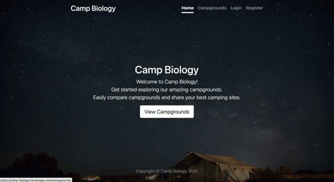

# Camp-Biology

Camp Biloigy is a web application that allows you to share your best camping sites around the world. Once you sign-up, you can begin to create your own campgrounds and comment on others campsites. Get started exploring our amazing campgrounds!

Live Demo can be view at <https://camp-biology.herokuapp.com/>

## Project First Look



## Key Features

- User registration & login portals
- Full campsite description & information
- Campsite details with map and images

- Campground add & edit & delete & view functionalities (CRUD)
- Campground reviews & ratings

## Technologies

- Node.js
- Express.js
- MongoDB
- React
- Git/Github

---

## Installation

To run this project in your local machine, please follow the instructions below.

### Prerequisites

- [npm](https://docs.npmjs.com/)
- [Node.js](https://nodejs.org/en/)
- [MongoDB](https://docs.mongodb.com/manual/installation/)
- [concurrently](https://www.npmjs.com/package/concurrently)

### Clone

Clone this repository to your local machine

```{ .git }
git clone https://github.com/smallpaes/expense-tracker.git
```

### Setup

#### 1. Enter the project folder

```{console}
cd expense-tracker
```

#### 2. Install npm packages

```{console}
npm run install-all-deps
```

#### 3. Activate the server

```{console}
npm run dev
```

#### 4. Check the message for successful activation

```{console}
> Server is running on port 5000
> MongoDB connected!!
.
.
> Compiled successfully!
> You can now view expanse-tracker in the browser.
```

Your application will be run on browser with the URL: <http://localhost:3000>
