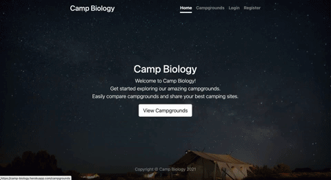

# Camp-Biology

Camp Biloigy is a web application that allows you to share your best camping sites around the world. Once you sign-up, you can begin to create your own campgrounds and comment on others campsites. Get started exploring our amazing campgrounds!

Live Demo can be view at <https://camp-biology.herokuapp.com/>

## Project First Look



## Key Features

- User registration & login & logout portals
- Full campsite description & information
- Campsite details with map and photo slideshow
- Campground add & edit & delete & view functionalities (CRUD)
- Campground reviews & ratings

## Technologies

- Node.js
- Express.js
- Passport.js
- EJS
- Bootstrap
- Cloudinary
- Mapbox
- Heroku
- MongoDB
- Git/Github

---

## Installation

To run this project in your local machine, please follow the instructions below.

### Prerequisites

- [npm](https://docs.npmjs.com/)
- [Node.js](https://nodejs.org/en/)
- [MongoDB](https://docs.mongodb.com/manual/installation/)

### Clone

Clone this repository to your local machine

```{ .git }
git clone https://github.com/LouisChen1013/Camp-Biology.git
```

### Setup

#### 1. Create an Mapbox & Cloudinary account

- [https://www.mapbox.com/](https://www.mapbox.com/)
- [https://cloudinary.com/](https://cloudinary.com/)

#### 2. Get Cloudinary Key and info

```(console)
Dashboard -> Account Details -> Cloud name & API Key & API Secret
```

#### 3. Get Mapbox Access token

```(console)
Account -> Tokens -> Default public token
```

#### 4. Enter the project folder

```{console}
cd Camp-Biology
```

#### 5. Install npm packages

```{console}
npm install
```

#### 6. Create .env file

```{console}
touch .env
```

#### 7. Store API Key in .env file and save

```{.env}
CLOUD_NAME=<YOUR_CLOUDINARY_CLOUD_NAME>
API_KEY=<YOUR_CLOUDINARY_APP_KEY>
API_SECRET=<YOUR_CLOUDINARY_SECRET>
MAPBOX_TOKEN=<YOUR_MAPBOX_TOKEN>
SECRET=<ANY_SECRET_YOU_CAN_USE>
```

#### 8. Activate the server

```{console}
npm start
```

#### 9. Check the message for successful activation

```{console}
> Server is running on port 3000
> Database connected
```

Your application will be run on browser with the URL: <http://localhost:3000>
